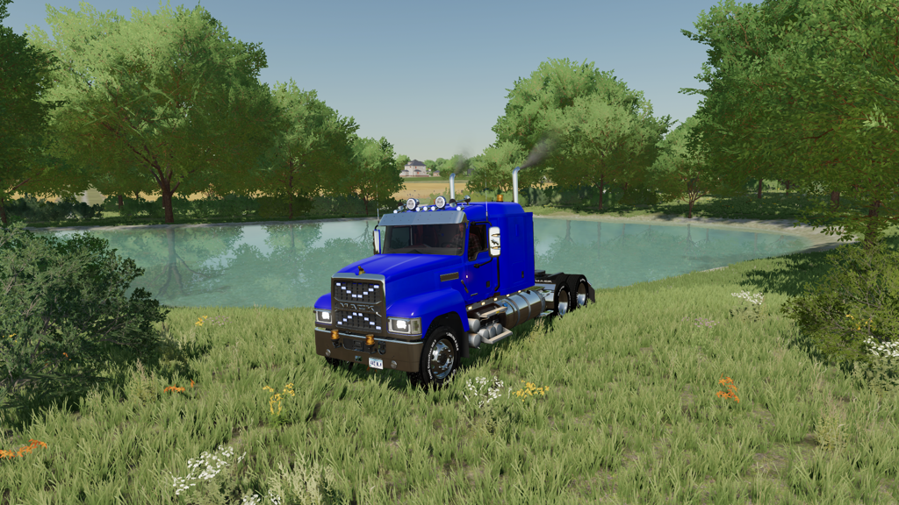
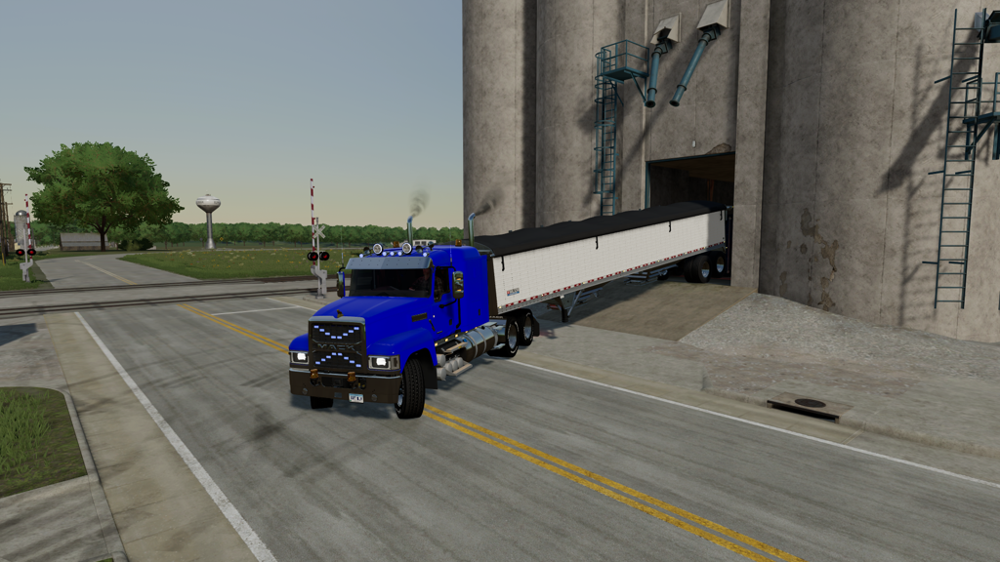

# FS22_DK_edit_Pinnacle_6x4

## *Nicely upgraded Mack Pinnacle*


Lots of options for this truck. Make it your own and let it fit your farm.


All configuratiosn as ingame but with additional stuff.


Night shot to try and show the additional lights.


Day cab


Daycab with fairing



Sleepercab 48


Sleepercab 48 with fairing


Sleepercab 70


```
Original author: Giants

Contributed by: DennisK

If you distribute this mod, always include this info.

AND DO NOT UPLOAD IT TO MONATERY UPLOAD SERVICES.
THIS MOD IS AVAILABLE TO ANYONE FOR FREE AND YOU CAN USE
IT AND EDIT IT ANYWAY YOU WANT FOR PERSONAL USE.
```


## New upload 2024-03-30 (release 2.0.0.0)

This is a new upload and is as good as done.

What is added:
-   Additional multi color lights in grill and at top
-   Beacons top or/and bottomfront
-   Tinted windows in multi grades
-   Lights on side of the truck
-   Reallights that comes from sidelights
-   Hella 3000 beam lights with daylight
-   Airhorns
-   Red interior light
-   Speed upgrade to 95 km/h
-   Added 750HP
-   Changed engine sound to detroit diesel 6 cilinder


## Note
Before downloading and using this mod always check the issues page. https://github.com/DennisKgaming/FS22_DK_edit_Pinnacle_6x4/issues

Sometimes issue are found and need to be solved first. Not all issues will give problems when using this mod.

## Multiplayer
Multiplayer is tested and supported.


## Guide / documentation

No additional guides needed for this mod.


Because GitHub has a certain way of packing a release please do the following:
- Unpack zip file
- Take out the main folder
- When in use for multiplayer: Zip the folder you took out of the zip filefolder
- Put (zip) folder in your mod directory


## Screenshots





## Additional information

Since this is a redesigned mod there is no support for console.

If you discover any issues please submit them to the issues page.